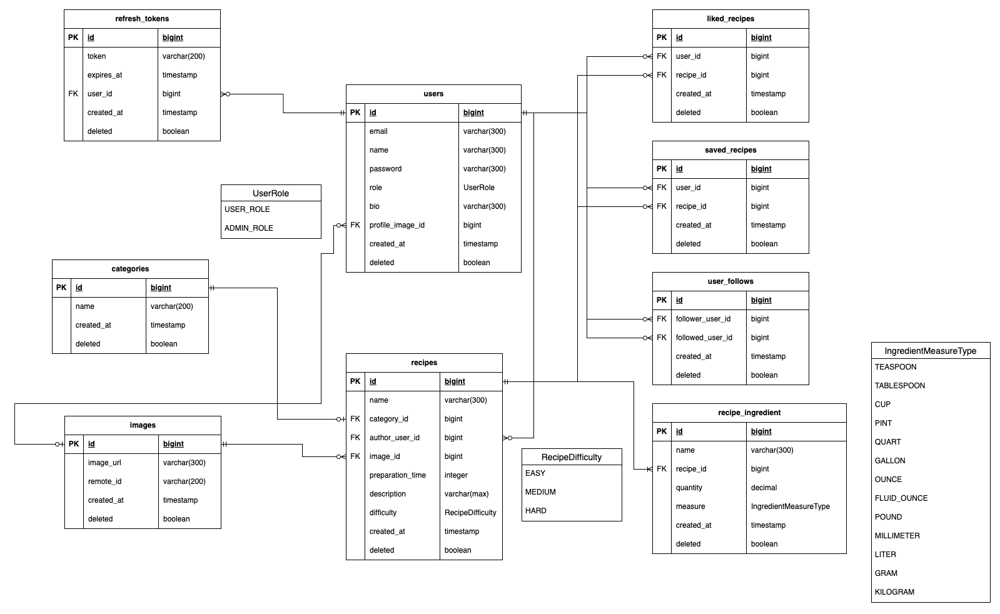

# cookscorner-backend

## CooksCorner ERD


## Running locally

### With maven command line
```bash
git clone git@github.com:Aktan-A/cookscorner-backend.git
cd cookscorner-backend/
./mvnw spring-boot:run
```

### With docker compose
```bash
docker compose -f docker-compose.dev.yml up --build -d
```

Swagger ui url: http://localhost:8080/swagger-ui/index.html

Technologies
- Spring
- Spring Boot
- Spring MVC
- PostgreSQL
- Lombok
- JWT
- Docker
- Cloudinary

## Environment Variables
| Key                          | Description                        |
|------------------------------|------------------------------------|
| BASE_URL                     | Domain of the application          |
| DB_URL                       | Database url.                      |
| DB_USERNAME                  | Database user username.            |
| DB_PASSWORD                  | Database user password.            |
| ACCESS_TOKEN_SECRET_KEY      | Secret for access tokens.          |
| ACCESS_TOKEN_EXPIRE_MINUTES  | Access token lifetime in minutes.  |
| REFRESH_TOKEN_EXPIRE_MINUTES | Refresh token lifetime in minutes. |
| CLOUDINARY_CLOUD_NAME        | Cloudinary cloud name.             |
| CLOUDINARY_API_KEY           | Cloudinary api key.                |
| CLOUDINARY_API_SECRET        | Cloudinary api secret.             |